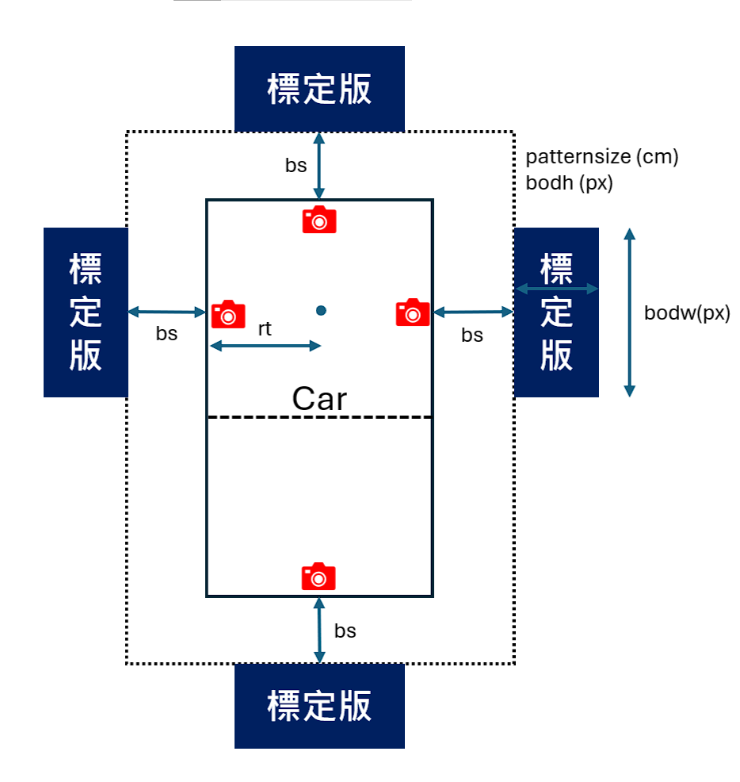

# TankPanorama

## 使用教學

### 介紹

本程式來自修改https://github.com/neozhaoliang/surround-view-system-introduction 的一個鳥瞰建置程式，並且參考此篇論文[Hemispherical 3D Around View Monitoring Algorithm Using Image Synthesis of Multi-Channel Cameras](https://ieeexplore.ieee.org/document/8581156)。透過對稱安裝相機在車輛四周，並透過透視變換使影像對齊，再透過球面投影到同一半徑之球體上。

### 安裝相機

如下圖所示安裝相機(請注意四個相機必須安裝在同一水平面上，並且HFOV必須大於150度)，而前三個相機放置在一個正方形三個邊的中點上的主要原因是，為了在減少前方畫面的視差，在setting.py 裡有一變數 patternsize 標定板的寬度和 bs 標定版與相機的距離需要手動設定，下方是一些需要手動設定的參數。

```python
# setting.py
# 這些參數在設定時可以忽略小數點，以及在設定都可以設定一個較整齊的數值
# ex. bodw = 998.777 可以直接設定為 bodw = 1000
sph_foc_len = 410# 統一球體半徑
sfovx = 90 #每個相機裁切的fov x 方向大小
sfovy = 70 #每個相機裁切的fov y 方向大小
targetw = 1800 # 去畸變換後的寬
targeth = 700 # 去畸變換後的高
f = 238 # 大約鏡頭焦距
patternsize = 70 # 真實基板高 (cm)
bodw =  1000 # 基板寬
bodh = 180 # 基板高
bs = 25 #標定版與相機的距離 (cm)
rt = 25 #左前右三個相機裡正方形中心點的距離 (cm)
```



### 拍攝標定板

請先在myyaml資料夾裡的四個yaml檔裡面，根據四個方位分別設定好camera_matrix、dist_coeffs參數，可以使用opencv的相機校正函式庫來得到，並且將四個鏡頭的焦距取平均過後設定到setting.py的 f (焦距)變數裡，並將車子停放在如圖一的四個標定版周圍，使用cap.py來拍照並請設定下方的變數值。

```python
#cap.py
number = 1 #camera number
name = "left" #direction of camera
c = 4 
'''
 c is for saving counter of picture.
 ex. when c=4, you will save a img as file name "frame4.png". 
 if you keep running cap.py and capture next picture, 
 next image will save as "frame5.png".
'''
```

也請在此時去到setting.py裡設定targetw和targeth，這兩個是去畸變後影像大小，你可能需要重複打開cap.py程式來得到一個最好的大小，在拍照完成後請將und_smimage資料夾裡的照片重新命名成四個方位的名稱("front", "back", "left", "right”).png。 

### 手動標定對應點進行水平校正

 先在run_get_align_projection_maps.py的main函數裡，設定要標定的鏡頭後，在執行程式。

```python
name = "front" # lines 58
```

手動設定四個點按下enter鍵，按d鍵可以刪除上一個點，q鍵會退出程式


查看終端機裡的bodw和bodh 將這兩個數值設定到setting.py的參數裡並關閉程式


再次執行run_get_align_projection_maps.py一次，手動設定四個點按下enter鍵。


得到水平校正後的畫面，在按一次enter會自動將參數記錄到yaml檔裡。


接下來請到setting.py裡設定sph_foc_len，一個計算sph_foc_len的方式是，根據下式

sph_foc_len = ( bs + rt ) * pc_ratio，你可以直接執行setting.py，來得到這個數字，


接下來請執行run_get_spherical_projection_maps.py，此時需要你自己手動設定setting.py裡的sfovy，並查看cy面

當sfovy = 45


當sfovy = 70


將他調整到可以容納整個影像之後，對任意視窗按下enter，程式將會自動存入參數的yaml檔內

### 產生邊界權重圖和產生全景圖

直接執行 run_get_panorama_weight.py 然後透過對隨意視窗點擊enter，會產生第一個全景圖


再次點擊enter後會得到，補上黑邊的2:1全景圖


再度點擊enter後，會得到將儲存mask.png和panorama.png在資料夾中


在此過程中你可以修改setting.py 的sph_foc_len來調整一個你認為合適的大小。

## 使用相機來查看畫面

在此程式中有兩個可以測試，全景功能是否有正常運作的程式，

[轉換矩陣](https://www.notion.so/a102f500306a4ca3b8fcc4bcbaadc84b?pvs=21)